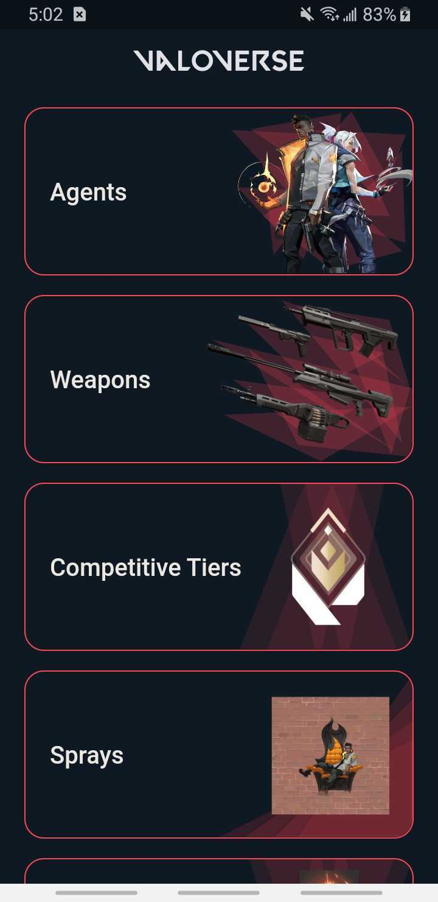
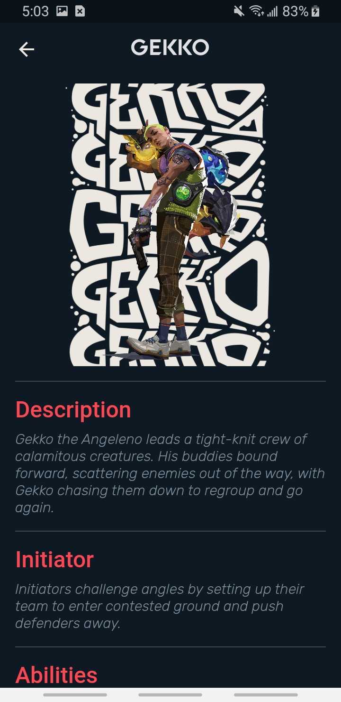
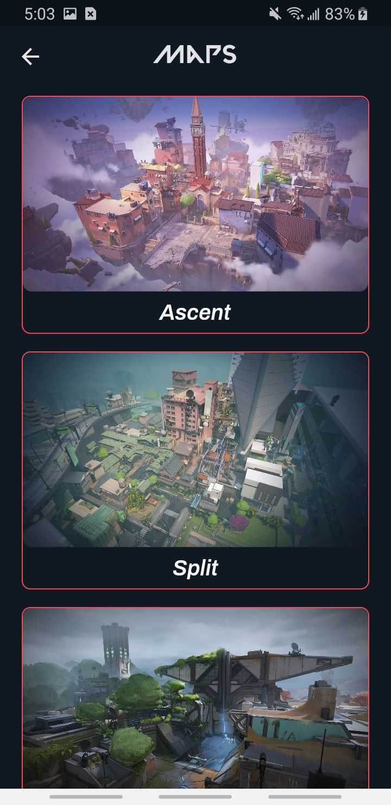
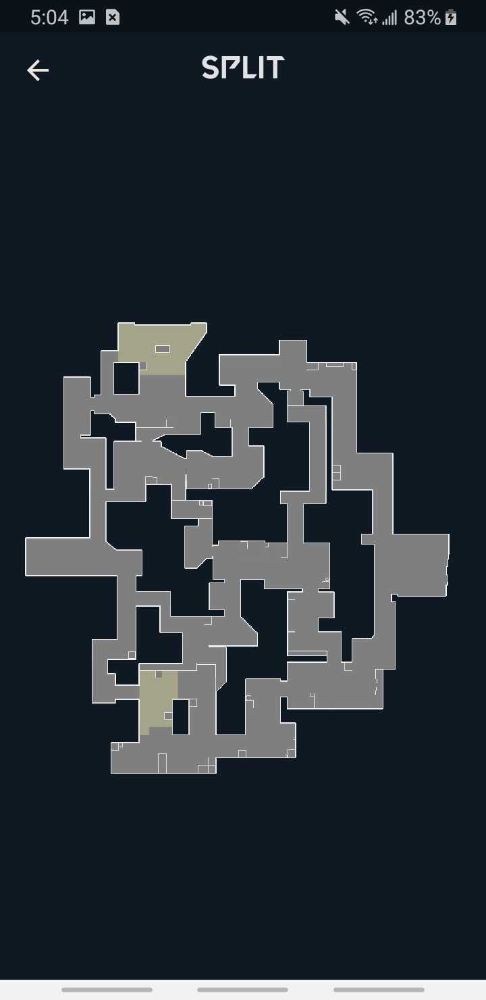
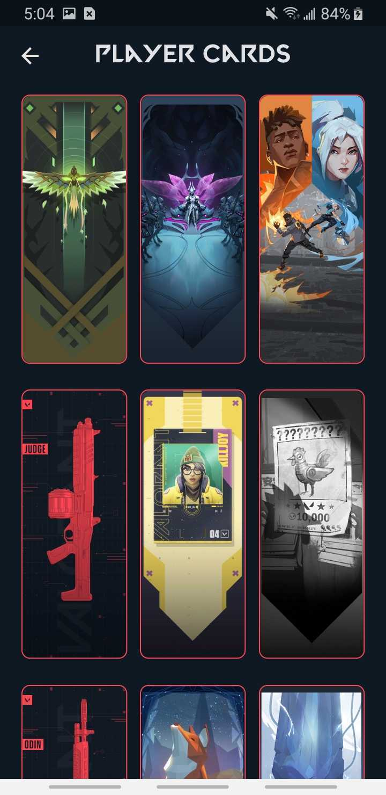
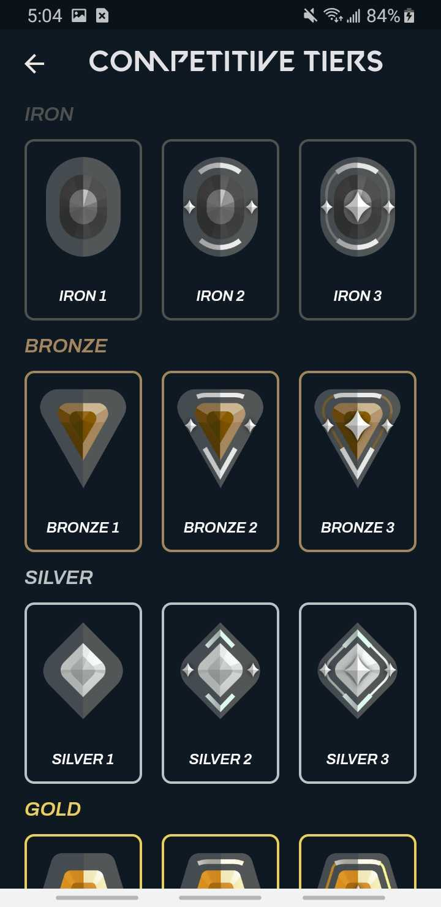
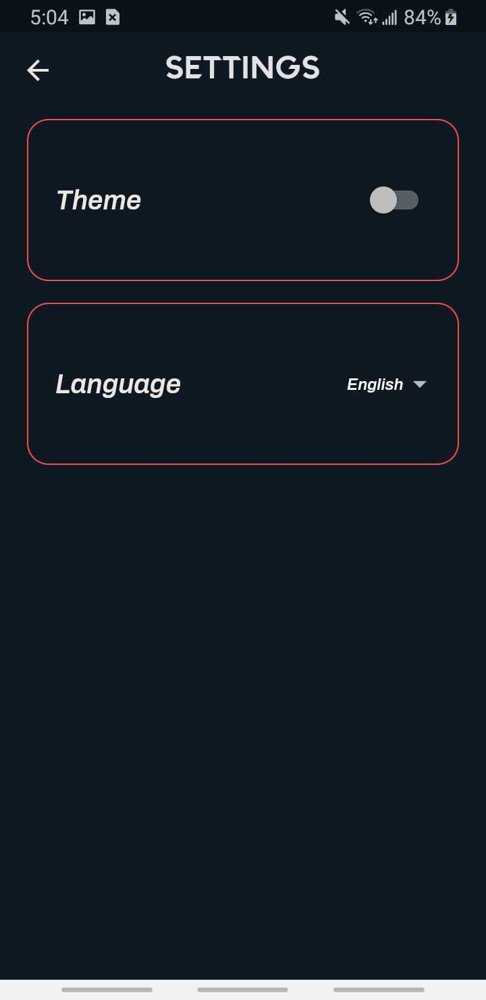
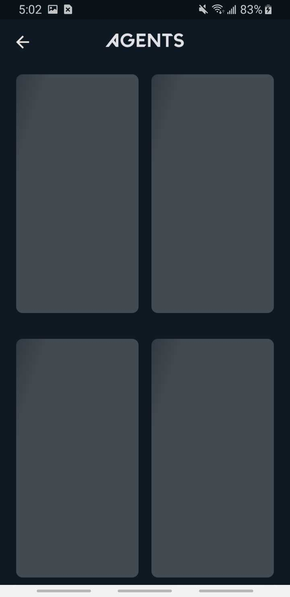
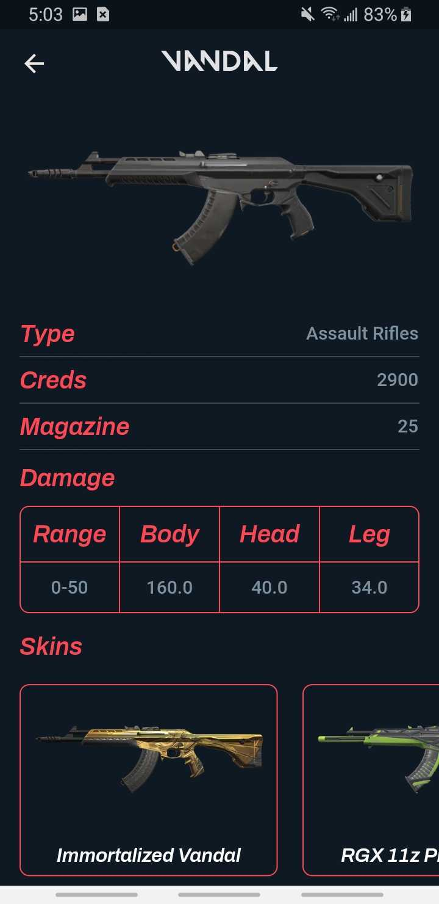

# ValoVerse

### ValoVerse is a unofficial wiki app for Valorant game. You can find informations about the game like agents, weapons, skins and maps etc.

# Google Play Store

 # Tech Stack

 - Dart / Flutter
 - State Management : [BLoC](https://pub.dev/packages/bloc)
 - Localization : [Easy Localization](https://pub.dev/packages/easy_localization)
 - Network Manager : [Connectivity Plus](https://pub.dev/packages/connectivity_plus)
 - Cache : [Shared Preferences](https://pub.dev/packages/shared_preferences)
 - API Service : [Valorant Api](https://valorant-api.com/)

 # Developers
 - [Eyüp Ensar Kuş](https://github.com/EyupEnsarKus1)
 - [İsmail Çakıcı](https://github.com/ismailcakici)
 
 # Preview 

 <table>
  <tr align='center'>
   <td colspan='2'>Home Page</td>
   <td colspan='2'>Agent Detail</td>
   <td colspan='2'>Maps</td>
   <td colspan='2'>Map Detail</td>
  </tr>
  <tr align='center'>
   <td colspan='2'></td>
   <td colspan='2'></td>
   <td colspan='2'></td>
   <td colspan='2'></td>
  </tr>
  
  <tr align='center'>
   <td colspan='2'>Player Cards</td>
   <td colspan='2'>Ranks</td>
   <td colspan='2'>Settings</td>
   <td colspan='2'>Shimmer</td>
  </tr>
  
  <tr align='center'>
   <td colspan='2'></td>
   <td colspan='2'></td>
   <td colspan='2'></td>
   <td colspan='2'></td>
  </tr>
  
  <tr align='center'>
   <td colspan='2'>Weapon Detail</td>
   <td colspan='2'>Weapon Skins Detail</td>
  </tr>
  
  <tr align='center'>
   <td colspan='2'></td>
   <td colspan='2'></td>
  </tr>
 </table>
